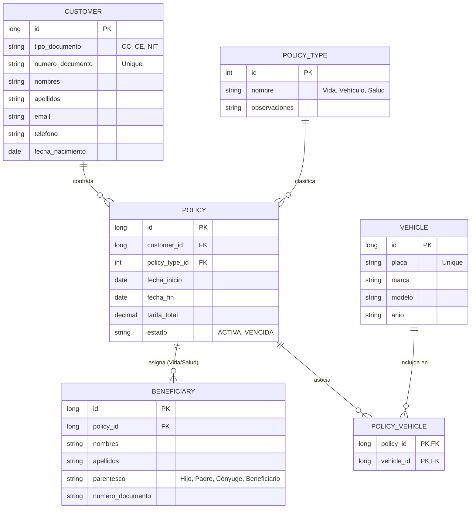

# Aseguradora API - Sistema de Gestión de Pólizas

Este proyecto es una solución backend diseñada para solventar la Prueba tecnica: Desarrollador Senior TI - Seguros Bolivar - 6025 - 6020

## 🏗️ Arquitectura: Hexagonal (Ports & Adapters)

Se ha seleccionado la Arquitectura Hexagonal como pilar fundamental para garantizar el desacoplamiento entre el núcleo de negocio y las tecnologías externas.

*   **Desacoplamiento Tecnológico:** La lógica de negocio es agnóstica a la base de datos o al framework. Esto permite transicionar de una base de datos en memoria (H2) a una persistencia relacional (MySQL/PostgreSQL) simplemente implementando un nuevo Adaptador, sin alterar una sola línea de lógica de negocio.

*   **Inversión de Dependencias:** La comunicación entre la capa de Aplicación (UseCases) y la Infraestructura (Adapters) se realiza estrictamente a través de Puertos (Interfaces), lo que facilita el mantenimiento y la evolución del sistema.

*   **Seguridad y Estándares con DTOs:** Se hace uso de DTOs (Data Transfer Objects) y MapStruct para el mapeo de entidades. Esta práctica limita la exposición de la estructura interna de las tablas, mejora la seguridad de la API y cumple con los estándares de la industria moderna.

## 📊 Modelo de Datos

A continuación se presenta el modelo de entidad-relación que soporta las reglas de negocio de pólizas múltiples, beneficiarios y vehículos:



> **Nota:** La relación entre Póliza y Vehículo se maneja mediante una tabla intermedia para permitir que un vehículo sea incluido en múltiples contratos si así se requiere.

## 🧠 Metodología de Cocreación con IA

El desarrollo de esta solución integró el uso de Inteligencia Artificial como un Copiloto Estratégico:

*   **Diseño y Parámetros:** Yo, como arquitecto principal, definí el diseño de la solución, los parámetros de construcción y las reglas de negocio críticas.
*   **Automatización Estructural:** Se solicitaron scripts de automatización (.sh) para la generación ágil de la estructura de archivos y el boilerplate inicial, optimizando el tiempo de configuración.
*   **Documentación y Transcripción:** La IA asistió en la transcripción de los parámetros de diseño dentro de la documentación técnica (JavaDoc) y comentarios del código.
*   **Auditoría y Validación:** Todo el código generado fue auditado, corregido y validado manualmente para asegurar el cumplimiento de las reglas de negocio y la calidad del software.

## ☁️ Propuesta de Arquitectura en AWS

Basado en una experiencia previa con GCP, se propone la siguiente ruta de evolución para el despliegue en Amazon Web Services:

### Fase 1: MVP Agil y Serverless (Validación de Producto)

*   **Cómputo:** AWS Lambda (Equivalente a Cloud Run) para procesar peticiones bajo demanda con costo optimizado.
*   **Persistencia:** Amazon DynamoDB (NoSQL, equivalente a Firestore) para un esquema flexible que permita iterar rápidamente el modelo de negocio.
*   **API Gateway:** Para la gestión de tráfico, seguridad y documentación de endpoints.

### Fase 2: Escalamiento y Producción (Contenedores)

*   **Cómputo:** Amazon ECS o AWS Fargate (Dockerizado).
*   **Persistencia:** Amazon RDS (MySQL/PostgreSQL) para manejar relaciones complejas y transaccionalidad robusta.
*   **CI/CD Pipeline:**
    *   **GitHub Actions:** Ejecución de pruebas y generación de imagen Docker.
    *   **Amazon ECR:** Almacenamiento de imágenes (Registry).
    *   **CD:** Actualización automática del servicio en el servidor mediante el pulling de la nueva imagen.

## 🛠️ Ejecución Local

### Prerrequisitos

*   Java 17+
*   Maven 3.9+

### Pasos para iniciar

1.  Clonar el repositorio.
2.  Ejecutar pruebas unitarias e integración:
    ```bash
    ./mvnw clean test
    ```
3.  Lanzar la aplicación:
    ```bash
    ./mvnw spring-boot:run
    ```
4.  **Swagger UI:** Acceder a [http://localhost:8080/swagger-ui.html](http://localhost:8080/swagger-ui.html) para probar los endpoints.
5.  **H2 Console:** Acceder a [http://localhost:8080/h2-console](http://localhost:8080/h2-console)
    *   **JDBC URL:** `jdbc:h2:mem:testdb`
    *   **User:** `sa`

---
*Desarrollado con enfoque en calidad, escalabilidad y buenas prácticas de ingeniería.*
