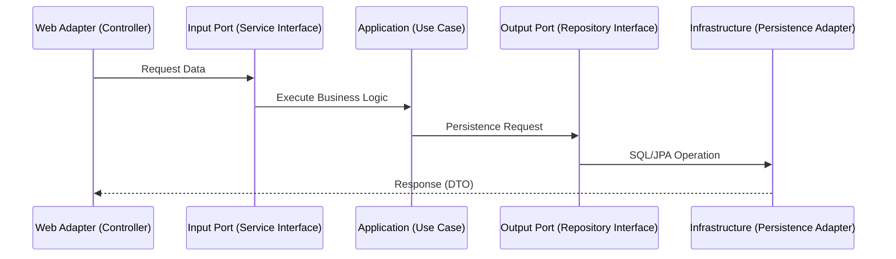
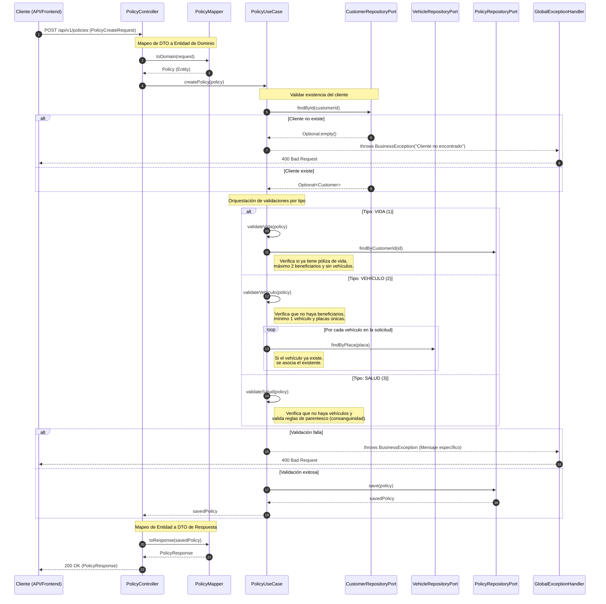
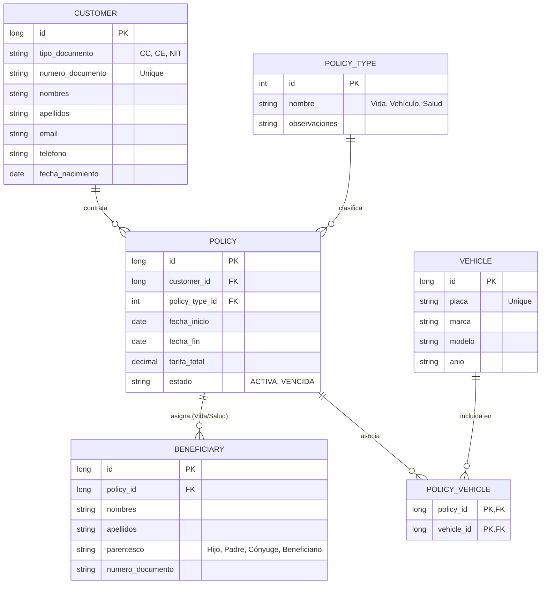

# Aseguradora API - Sistema de Gestión de Pólizas

Este proyecto es una solución backend diseñada para solventar la Prueba tecnica: Desarrollador Senior TI - Seguros Bolivar - 6025 - 6020

### Nota> Visualización de Diagramas (Mermaid)
Este README utiliza Mermaid.js para representar la arquitectura y los flujos de datos. Para visualizarlos correctamente:

GitHub/GitLab: Se renderizan automáticamente en el navegador.
VS Code: Se recomienda la extensión Markdown Preview Mermaid Support.
IntelliJ IDEA: Requiere el plugin Mermaid.
Online: Si no dispone de estas herramientas, puede copiar el código del diagrama y pegarlo en Mermaid Live Editor.

##  Arquitectura: Hexagonal (Ports & Adapters)

Se ha seleccionado la Arquitectura Hexagonal como pilar fundamental para garantizar el desacoplamiento entre el núcleo de negocio y las tecnologías externas.

*   **Desacoplamiento Tecnológico:** La lógica de negocio es agnóstica a la base de datos o al framework. Esto permite transicionar de una base de datos en memoria (H2) a una persistencia relacional (MySQL/PostgreSQL) simplemente implementando un nuevo Adaptador, sin alterar una sola línea de lógica de negocio. Esto permite Evolucionar sin el mayor problema de una implementación de serverless con bases noSql a un infraestructura en un servidor con una base de datos relacional si en la evolución natural de negocio se reuiere una evolución asi. 

*   **Inversión de Dependencias:** La comunicación entre la capa de Aplicación (UseCases) y la Infraestructura (Adapters) se realiza estrictamente a través de Puertos (Interfaces), lo que facilita el mantenimiento y la evolución del sistema.

*   **Seguridad y Estándares con DTOs:** Se hace uso de DTOs (Data Transfer Objects) y MapStruct para el mapeo de entidades. Esta práctica limita la exposición de la estructura interna de las tablas, mejora la seguridad de la API y cumple con los estándares de la industria moderna.


### Diagrama de Secuencia Arquitectura Hexagonal

A continuación presento la secuencia de la aruitectura y comunicación entre modulos

### Estructura de Proyecto (Arquitectura Hexagonal)

```
aseguradora-api
├── src/main/java/com/pruebasegurosbolivar/aseguradora_api
│   ├── application/                # Capa de Aplicación (Orquestación)
│   │   └── usecases/               # Lógica de negocio (Ej: PolicyUseCase)
│   ├── domain/                     # Capa de Dominio (El Corazón)
│   │   ├── model/                  
│   │   │   ├── entity/             # Entidades (Customer, Policy, etc.)
│   │   │   └── exception/          # Excepciones de negocio (BusinessException)
│   │   └── ports/                  
│   │       ├── in/                 # Interfaces de entrada (Service Ports)
│   │       └── out/                # Interfaces de salida (Repository Ports)
│   └── infrastructure/             # Capa de Infraestructura (Detalles Técnicos)
│       ├── adapter/                
│       │   ├── in/web/             # Controladores REST, DTOs y Mappers
│       │   └── out/persistence/    # Adaptadores de BD y Repositorios JPA
│       └── config/                 # Configuraciones (Seguridad, Swagger, Errores)
├── src/main/resources
│   ├── application.properties      # Configuración de entorno y base de datos
│   └── import.sql                  # Inicialización del catálogo (Vida, Vehículo, Salud) 
└── pom.xml                         # Gestión de dependencias (Lombok, MapStruct, JPA)
```

## Diagrama de Flujo: Creación de Pólizas y Validación de Errores

A continuación se presenta el diseño estructurado del flujo mas critico correspondiente a la creación de las polizas.



##  Modelo de Datos

A continuación se presenta el modelo de entidad-relación que soporta las reglas de negocio de pólizas múltiples, beneficiarios y vehículos:



> **Nota:** La relación entre Póliza y Vehículo se maneja mediante una tabla intermedia para permitir que un vehículo sea incluido en múltiples contratos si así se requiere.

### Escalabilidad y Extensibilidad: ``` Tabla policy_types ```

Se ha implementado una tabla maestra denominada ``` policy_types ```  para categorizar los productos de la aseguradora. Esta decisión de diseño desacopla la lógica de negocio de identificadores estáticos, permitiendo:

Ampliación del Portafolio: Es posible integrar nuevos ramos (ej. Hogar, Mascotas, Desempleo) simplemente insertando nuevos registros en esta tabla, sin requerir cambios estructurales en la base de datos.

Mantenimiento Ágil: Facilita la actualización de nombres o descripciones comerciales de los tipos de póliza de forma centralizada, en caso de requerirse cambios en la lógica de negocio hay facilidad de mantenimiento por la separación de la capa de negocio.


## Calidad y Cobertura de Código
Se ha implementado una estrategia de pruebas unitarias e integración enfocada en la robustez de la lógica de negocio.
* Cobertura: El proyecto cumple con un 80% de cobertura en las capas de Controller y Service (UseCases), garantizando la validación de los flujos principales y alternos.
* Pruebas Unitarias: Se validan reglas críticas como la restricción de una sola póliza de vida por cliente y los límites de beneficiarios.
* Manejo de Errores: Se integró un GlobalExceptionHandler que intercepta las BusinessException para retornar códigos de estado HTTP estandarizados (200, 400, 500) según el requerimiento.
* Herramientas: Uso de JUnit 5, Mockito para el aislamiento de dependencias y MockMvc para la validación de los contratos REST.

##  Metodología de Cocreación con IA

El desarrollo de esta solución integró el uso de Inteligencia Artificial como un Copiloto Estratégico:

*   **Diseño y Parámetros:** Yo, como arquitecto principal, definí el diseño de la solución, los parámetros de construcción y las reglas de negocio críticas.
*   **Automatización Estructural:** Se solicitaron scripts de automatización (.sh) para la generación ágil de la estructura de archivos y el boilerplate inicial, optimizando el tiempo de configuración.
*   **Documentación y Transcripción:** La IA asistió en la transcripción de los parámetros de diseño dentro de la documentación técnica (JavaDoc) y comentarios del código.
*   **Auditoría y Validación:** Todo el código generado fue auditado, corregido y validado manualmente para asegurar el cumplimiento de las reglas de negocio y la calidad del software.

##  Propuesta de Arquitectura en AWS

BBajo una asunción de que este proyecto obedece a una entrega a un cliente, se propone la siguiente ruta de evolución para el despliegue en Amazon Web Services:

### Fase 1: MVP Agil y Serverless (Validación de Producto)

*   **Cómputo:** AWS Lambda para procesar peticiones bajo demanda con costo optimizado.
*   **Persistencia:** Amazon DynamoDB (NoSQL) para un esquema flexible que permita iterar rápidamente el modelo de negocio.
*   **API Gateway:** Para la gestión de tráfico, seguridad y documentación de endpoints.
*   **Ganancia en negocio:** Permite una validación rapida del modelo y de bajo costo debido a que los costos son bajo demanda de uso.
  

### Fase 2: Escalamiento y Producción (Contenedores)

*   **Cómputo:** Amazon ECS o AWS Fargate (Dockerizado).
*   **Persistencia:** Amazon RDS (MySQL/PostgreSQL) para manejar relaciones complejas y transaccionalidad robusta.
*   **CI/CD Pipeline:**
    *   **GitHub Actions:** Ejecución de pruebas y generación de imagen Docker.
    *   **Amazon ECR:** Almacenamiento de imágenes.
    *   **CD:** Actualización automática del servicio en el servidor mediante el pulling de la nueva imagen.
*   **Ganancia en negocio:** Aqui se busca un sistema mas estable y de facil mantenimiento  y escalabilidad.

##  Ejecución Local

### Prerrequisitos

*   Java 17+
*   Maven 3.9+

### Pasos para iniciar

1.  Clonar el repositorio.
2.  Ejecutar pruebas unitarias e integración:
    ```bash
    ./mvnw clean test
    ```
3.  Lanzar la aplicación:
    ```bash
    ./mvnw spring-boot:run
    ```
4.  **Swagger UI:** Acceder a [http://localhost:8080/swagger-ui.html](http://localhost:8080/swagger-ui.html) para probar los endpoints.
5.  **H2 Console:** Acceder a [http://localhost:8080/h2-console](http://localhost:8080/h2-console)
    *   **JDBC URL:** `jdbc:h2:mem:testdb`
    *   **User:** `sa`
6.  **Generación de JavaDocs:** Correr el comando
    ```bash
    ./mvnw javadoc:javadoc
    ```
---
*Desarrollado con enfoque en calidad, escalabilidad y buenas prácticas de ingeniería.*
